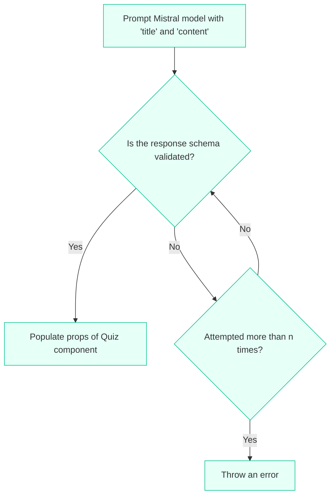

Time taken: 11 hours

<div align="center">
  
  <h1 align="center">MintLearn</h1>
</div>

<br/>

## Overview

MintLearn is an interactive quiz generation platform that transforms any content into engaging quizzes using AI. Powered by Mistral AI, it creates adaptive learning experiences that evolve based on user performance.

## Features

- **AI-Powered Quiz Generation**: Convert any text content into well-structured quizzes
- **Adaptive Learning**: Questions adjust based on previous performance
- **Instant Feedback**: See detailed results and correct answers immediately
- **Progress Tracking**: Monitor your learning journey with comprehensive scoring
- **Retry Mechanism**: Generate similar quizzes focusing on areas that need improvement

## How It Works

The quiz generation process follows these steps:

1. User inputs content and title
2. Mistral AI analyzes the content and generates relevant questions
3. Questions are stored with multiple-choice options
4. User attempts the quiz
5. Results are analyzed for adaptive learning
6. New quizzes can be generated focusing on weak areas

### How a Quiz is generated



The schema that is expected from the LLM is below

```json
{
  "questions": [
    {
      "id": 1,
      "title": "Question text here",
      "options": [
        {
          "id": 1,
          "content": "First option"
        },
        {
          "id": 2,
          "content": "Second option"
        },
        {
          "id": 3,
          "content": "Third option"
        },
        {
          "id": 4,
          "content": "Fourth option"
        }
      ],
      "correct": 2 // Integer representing the correct option position (1-4)
    }
  ]
}
```

The schema validation ensures:

- Each question has exactly 4 options
- IDs are sequential numbers
- The 'correct' field is a number 1-4 representing the position of the correct answer
- All required fields are present and properly formatted

## Getting Started

If you do not have turso installed on your computer please run the following command:

```bash
# For macOS
brew install tursodatabase/tap/turso

# For linux or windows
curl -sSfL https://get.tur.so/install.sh | bash
```

Then to actually set up the project:

```bash
# Clone the repository
git clone https://github.com/yourusername/mintlearn.git

# Install dependencies
npm install

# Run development server for turso
turso dev

# Initialize the database
npm run init-db

# Run the development server
npm run dev
```

Open [http://localhost:3000](http://localhost:3000) with your browser to see the result.

## Environment Setup

Create a `.env` file with:

```env
MISTRAL_API_KEY=your_api_key_here
TURSO_DATABASE_URL=http://127.0.0.1:8080
```

## Technology Stack

- **Frontend**: Next.js 15, TailwindCSS
- **Database**: libSQL, Turso
- **AI Model**: Mistral
- **Language**: TypeScript

## Contributing

Contributions are welcome! Please feel free to submit a Pull Request.
